# BPMN to X-Klaim Translation Reference

This document lists the translation rules B2XKlaim applies to each BPMN element. Every rule maps one BPMN construct to an equivalent X-Klaim skeleton. A third column, **Robotic Context**, gives a concrete interpretation of the construct in a multi-robot setting, to help engineers reason about what the generated code will actually do on a fleet.

**Conventions.** `e`, `e1`, `e2`, ... denote sequence-flow edge identifiers (rendered as tuples in the local space). `m`, `s` denote message and signal names. `P`, `P1`, `P2` denote sub-processes to be recursively translated. `d` is a timer duration in milliseconds. `vars` is a variable binding template; `payload` is an outgoing tuple payload. `self` is the current node; `senderLoc` and `receiverLoc` are pool names resolved by the translator.

## Sequence Flow

A sequence flow between two elements `P1` and `P2` is rendered as a rendezvous over a tuple named after the edge. `P1` emits the tuple on completion, and `P2` waits for it before starting.

<table>
<tr><th>BPMN Element</th><th>X-Klaim Translation</th></tr>
<tr>
<td>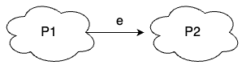</td>
<td>

```
translate(P1)
in(e)@self
translate(P2)
```

</td>
</tr>
</table>

## Events

Events mainly handle communication. In X-Klaim, message and signal exchanges are realised through `out`, `in`, and `read` actions over tuples.

<table>
<tr>
  <th>BPMN Element</th>
  <th>Icon</th>
  <th>X-Klaim Translation</th>
  <th>Robotic Context</th>
</tr>

<tr>
<td>None Start</td>
<td>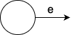</td>
<td>

```
out(e)@self
```

</td>
<td>Mission entry point. Kicks off the robot's behaviour unconditionally.</td>
</tr>

<tr>
<td>Message Start</td>
<td>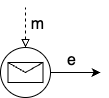</td>
<td>

```
in(m, vars)@self
out(e)@self
```

</td>
<td>Robot waits for an incoming command or task assignment before starting (e.g. ground control issues "begin patrol").</td>
</tr>

<tr>
<td>Timer Start</td>
<td>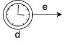</td>
<td>

```
Thread.sleep(d)
out(e)@self
```

</td>
<td>Delayed or scheduled activation. Behaviour starts after a countdown (e.g. staged departure).</td>
</tr>

<tr>
<td>Signal Start</td>
<td>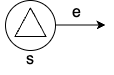</td>
<td>

```
read(s, vars)@senderLoc
out(e)@self
```

</td>
<td>Broadcast-triggered start. Every listening robot activates on a shared "go" signal sent to all participants.</td>
</tr>

<tr>
<td>Message Intermediate Catching</td>
<td>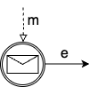</td>
<td>

```
in(m, vars)@self
out(e)@self
```

</td>
<td>Mid-mission wait for a peer-to-peer update (e.g. drone blocks until rover reports "area scanned").</td>
</tr>

<tr>
<td>Timer Intermediate Catching</td>
<td>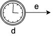</td>
<td>

```
Thread.sleep(d)
out(e)@self
```

</td>
<td>In-flight delay or cool-down (e.g. let sensors stabilise before the next reading).</td>
</tr>

<tr>
<td>Signal Intermediate Catching</td>
<td>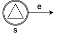</td>
<td>

```
read(s, vars)@senderLoc
out(e)@self
```

</td>
<td>React to a broadcast event observed from any peer (e.g. emergency halt received by all participants).</td>
</tr>

<tr>
<td>Message Intermediate Throwing</td>
<td>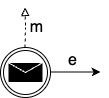</td>
<td>

```
out(m, payload)@receiverLoc
out(e)@self
```

</td>
<td>Send a targeted update or request to a specific peer robot (e.g. drone tells rover "waypoint reached").</td>
</tr>

<tr>
<td>Signal Intermediate Throwing</td>
<td>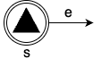</td>
<td>

```
out(s, payload)@self
Thread.sleep(signalDuration)
in(s, payload)@self
out(e)@self
```

</td>
<td>Broadcast an event to all other robots for a bounded window (e.g. announce "low battery, returning" to the other participants).</td>
</tr>

<tr>
<td>None End</td>
<td></td>
<td><em>(no emission)</em></td>
<td>Normal task termination. The robot's branch simply ends.</td>
</tr>

<tr>
<td>Message End</td>
<td>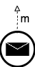</td>
<td>

```
out(m, payload)@receiverLoc
```

</td>
<td>Terminate with a directed completion report (e.g. mission result sent to operator or coordinator).</td>
</tr>

<tr>
<td>Signal End</td>
<td>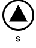</td>
<td>

```
out(s, payload)@self
Thread.sleep(signalDuration)
in(s, payload)@self
```

</td>
<td>Broadcast mission completion to the other robots before terminating.</td>
</tr>

</table>

**Unicast vs. broadcast.** Message events implement *unicast*: a targeted `out(m, payload)@receiverLoc` matched by an `in(m, vars)@self` on the recipient, removing the tuple on consumption. Signal events implement *broadcast*: `out(s, payload)@self` emits the tuple locally, and any number of peers can `read` it concurrently without removing it; the emitter's own `in` after `signalDuration` then garbage-collects the tuple.

## Gateways

<table>
<tr>
  <th>BPMN Element</th>
  <th>Icon</th>
  <th>X-Klaim Translation</th>
  <th>Robotic Context</th>
</tr>

<tr>
<td>XOR (exclusive)</td>
<td>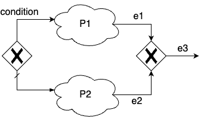</td>
<td>

```
if (condition) {
  translate(P1)
  in(e1)@self
} else {
  translate(P2)
  in(e2)@self
}
out(e3)@self
```

</td>
<td>Sensor- or state-conditioned branching (e.g. <code>if obstacle_detected then avoid else continue</code>).</td>
</tr>

<tr>
<td>Loop</td>
<td>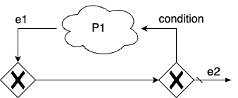</td>
<td>

```
while (condition) {
  translate(P1)
  in(e1)@self
}
out(e2)@self
```

</td>
<td>Repeat until the condition fails (e.g. <code>while battery &gt; 30% keep scanning</code>, or retry-until-success patterns).</td>
</tr>

<tr>
<td>AND (parallel)</td>
<td>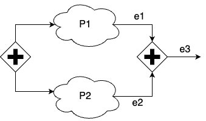</td>
<td>

```
eval(new ProcP1())@self
eval(new ProcP2())@self
in(e1)@self
in(e2)@self
out(e3)@self

// auxiliary procs added to the node:
proc ProcP1() { translate(P1) }
proc ProcP2() { translate(P2) }
```

</td>
<td>Concurrent subsystems. Navigation runs alongside telemetry streaming and perception; the join waits for all branches to finish.</td>
</tr>

<tr>
<td>Event-Based (messages only)</td>
<td>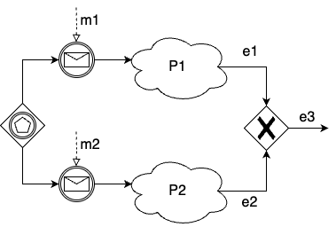</td>
<td>

```
var eventOccured = false
while (!eventOccured) {
  if (in(m1, vars1)@self within pollTimeout) {
    eventOccured = true
    translate(P1)
    in(e1)@self
  } else if (in(m2, vars2)@self within pollTimeout) {
    eventOccured = true
    translate(P2)
    in(e2)@self
  }
}
out(e3)@self
```

</td>
<td>Race between competing inputs. Take the first command to arrive from any controller or peer.</td>
</tr>

<tr>
<td>Event-Based (single message + timer)</td>
<td>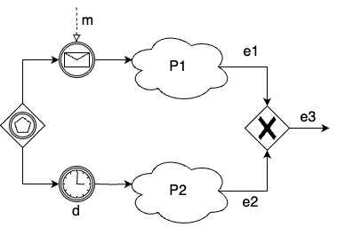</td>
<td>

```
if (in(m, vars)@self within d) {
  translate(P1)
  in(e1)@self
} else {
  translate(P2)
  in(e2)@self
}
out(e3)@self
```

</td>
<td>"Wait for confirmation or timeout" pattern. For example, await go/no-go within 5 s, otherwise fall back to default behaviour.</td>
</tr>

<tr>
<td>Event-Based (messages + timer)</td>
<td>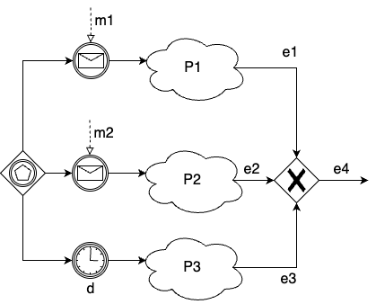</td>
<td>

```
var eventOccured = false
var startTime = System.currentTimeMillis()
while (!eventOccured) {
  if (in(m1, vars1)@self within pollTimeout) {
    eventOccured = true
    translate(P1)
    in(e1)@self
  } else if (in(m2, vars2)@self within pollTimeout) {
    eventOccured = true
    translate(P2)
    in(e2)@self
  } else if (System.currentTimeMillis() - startTime >= d) {
    eventOccured = true
    translate(P3)
    in(e3)@self
  }
}
out(e4)@self
```

</td>
<td>First-come race with a deadline. React to whichever event (sensor report, peer message, deadline) fires first.</td>
</tr>

</table>

The XOR maps to `if`/`else`; the loop to `while`; the parallel gateway spawns each branch with `eval` and joins them through a sequence of `in` actions (one per branch, reading the branch's terminal edge). The event-based gateway has three distinct patterns depending on which events it connects: a polling loop when only messages compete, a plain `in ... within d` when a single message races a timer, and a polling loop with elapsed-time check when several messages race a timer.

## Activities

<table>
<tr>
  <th>BPMN Element</th>
  <th>Icon</th>
  <th>X-Klaim Translation</th>
  <th>Robotic Context</th>
</tr>

<tr>
<td>Call Activity</td>
<td>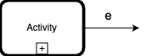</td>
<td>

```
eval(new Activity(e))@self

// auxiliary proc added to the node:
proc Activity(String edgeOut) {
  translate(CalledProcess)
  out(edgeOut)@self
}
```

</td>
<td>A complex, composite task whose internals are specified by an embedded BPMN diagram (e.g. a <code>dock-and-recharge</code> routine with its own flow of steps). The embedded diagram is compiled into its own proc, invoked when the parent mission reaches the activity, and can be reused across missions.</td>
</tr>

<tr>
<td>Event Sub-Process</td>
<td>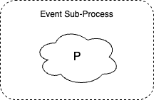</td>
<td>

```
eval(new EventSubProcess())@self

// auxiliary proc added to the node:
proc EventSubProcess() {
  translate(P)
}
```

</td>
<td>Event or exception handler running alongside the main flow (e.g. low-battery recovery, obstacle-detected fallback).</td>
</tr>

<tr>
<td>Script Task</td>
<td>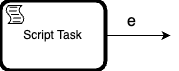</td>
<td>

```
eval(new ScriptTask(e))@self

// auxiliary proc added to the node:
proc ScriptTask(String edgeOut) {
  // ... add here the script code ...
  out(edgeOut)@self
}
```

</td>
<td>Atomic robot action. A sensor read, actuator command, planning call, or local computation the developer fills in.</td>
</tr>

</table>

Call activities and event sub-processes produce new procs defined separately and spawned via `eval`. Script tasks generate a placeholder proc for the developer's logic, followed by an `out` that marks the outgoing edge.

**Data objects.** A BPMN data object of type `DataObject` is represented as a tuple `(DataObject, vars)` whose fields carry its attributes, so it can be passed and matched in communication actions.

## Pools

<table>
<tr>
  <th>BPMN Element</th>
  <th>Icon</th>
  <th>X-Klaim Translation</th>
  <th>Robotic Context</th>
</tr>

<tr>
<td>Pool</td>
<td>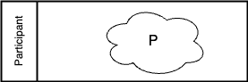</td>
<td>

```
node Participant { translate(P) }
```

</td>
<td>A single robot or agent with its own local tuple space.</td>
</tr>

<tr>
<td>Multi-Instance Pool</td>
<td>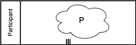</td>
<td>

```
node Participant_1 { translate(P) }
...
node Participant_N { translate(P) }
```

</td>
<td>A homogeneous fleet of participants. N identical agents (e.g. N drones) each running the same behaviour.</td>
</tr>

</table>
